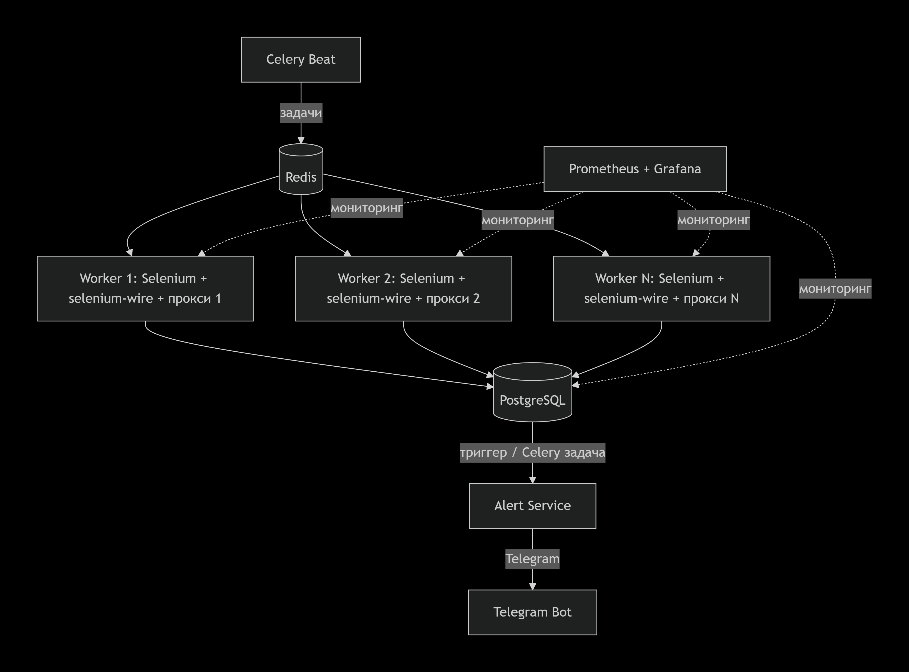

# Architecture.md 

## 1. Цели и требования

- **Объём**: 500 товаров × 20 поисковых запросов = **10 000 проверок в день**
- **Хранение результатов**: PostgreSQL
- **Алёрты**: Telegram-уведомление, если позиция товара упала ниже 50
- **Устойчивость**: сервис не должен блокироваться Ozon
- **Масштабируемость**: горизонтальное расширение при росте нагрузки

## 2. Расчёт нагрузки и планирование

10 000 проверок в сутки ≈ **7 задач в минуту** (при равномерном распределении).  
Одна задача (открытие страницы + пагинация до 4–5 страниц + поиск SKU) занимает в среднем **30–60 секунд** с учётом задержек.

**Необходимая мощность**:  
При 7 задачах в минуту и времени выполнения ≈ 1 минута нужно минимум **7 параллельных воркеров**.  
С учётом retry и задержек закладываем **10–12 Celery-воркеров**, распределённых на 2–3 сервера.

## 3. Технологический стек (с учётом текущей реализации)

| Компонент                  | Технология                          | Обоснование |
|---------------------------|-------------------------------------|-------------|
| Парсинг                   | Selenium + webdriver-manager + Camoufox | Уже работает в проекте, максимальная имитация браузера |
| Прокси с аутентификацией  | selenium-wire                       | Удобная передача логин/пароль, проверена производительность |
| Очередь задач             | **Celery 5 + Redis**                | Распределение, retry, приоритеты, мониторинг (Flower) |
| База данных               | **PostgreSQL 16**                   | индексы, триггеры для алёртов |
| Планировщик               | Celery Beat                         | Cron-расписание и равномерное распределение |
| Мониторинг                | Prometheus + Grafana                | Метрики парсинга, времени выполнения, ошибок |
| Алёрты                    | python-telegram-bot / aiogram       | Простая интеграция |
| Контейнеризация           | Docker + Docker Compose             | Унификация окружения |

## 4. Архитектурное описание
  

Каждый Celery-воркер запускается в отдельном Docker-контейнере со своим уникальным residential-прокси.  
Воркер получает задачу (sku + query), выполняет полный цикл поиска, сохраняет результат и передаёт данные в сервис алёртов.  
При любой ошибке задача автоматически возвращается в очередь с экспоненциальной задержкой.

## 5. Обеспечение устойчивости

### 5.1 Прокси
- Используем только **residential proxies** (реальные домашние IP).
- Провайдеры: Bright Data, ProxyEmpire.
- 50–100 IP, ротация каждые 10 запросов или каждые 30 минут.
- Передача через selenium-wire.

### 5.2 Rate limiting
- На один IP: 1 запрос каждые 10–15 секунд.
- На один товар (sku + query): не чаще 1 раза в 2 часа.
- Глобально: не более 150 запросов в час на весь сервис.

### 5.3 Имитация реального пользователя
- Перед поиском открываем главную ozon.ru + имитируем просмотр (3–5 сек + скролл).
- Случайные задержки: `random.uniform(3, 6)` между страницами, `1–2 сек` между действиями.
- Ротация User-Agent (50+ вариантов).
- Headless-режим: `--headless=new`.

### 5.4 Обработка ошибок

| Тип ошибки                  | Действие |
|----------------------------|----------|
| 407 / 403 / доступ ограничен | Смена прокси + повтор через 60 сек (до 3 раз) |
| Timeout (>30 сек)          | Повтор через 30 сек |
| Меньше 10 товаров на странице | Повтор с другим параметром сортировки |
| 5xx от Ozon                | Dead letter + алерт админу |
| Капча                      | 2Captcha + повтор после решения |

### 5.5 Retry-стратегия (Celery)
- Максимум 3 попытки.
- Экспоненциальная задержка: 60 → 300 → 900 сек.
- После 3 неудач — задача помечается FAILED + отправляется алерт.

## Схема базы данных и алерты

```sql
CREATE TABLE positions (
    id            BIGSERIAL PRIMARY KEY,
    sku           VARCHAR(20)  NOT NULL,
    query         TEXT         NOT NULL,
    position      INT,                     -- NULL = not_found
    page          INT,
    total_checked INT,
    url           TEXT,
    checked_at    TIMESTAMPTZ  NOT NULL DEFAULT NOW()
);

CREATE INDEX idx_positions_sku_checked ON positions (sku, checked_at DESC);
CREATE INDEX idx_positions_query ON positions (query);

CREATE TABLE alerts (
    id       BIGSERIAL PRIMARY KEY,
    sku      VARCHAR(20) NOT NULL,
    query    TEXT        NOT NULL,
    old_pos  INT,
    new_pos  INT,
    sent_at  TIMESTAMPTZ DEFAULT NOW()
);
```

## 6. Бюджет на инфраструктуру (в месяц, руб.)

| Статья                    | Детали                                   | Стоимость |
|--------------------------|------------------------------------------|---------|
| VPS (2 шт.)              | 4 vCPU, 8 GB RAM, 80 GB SSD (Hetzner/TimeWeb) | ~6 000 |
| Residential proxies      | 50–100 IP, 30–50 ГБ трафика              | ~12 000 |
| PostgreSQL (managed)     | опционально                              | 0–3 000 |
| Мониторинг               | Prometheus + Grafana                     | 0 |
| Резервное копирование    | S3                                       | ~500 |
| **Итого**                |                                          | **18 000 – 20 000 ₽** |


## 7. Риски

| Риск                              | Вероятность | Влияние | Снижение |
|-----------------------------------|-------------|---------|---------|
| Ozon меняет структуру страницы    | Высокая     | Высокое | Универсальные селекторы + мониторинг % успеха + raw HTML лог |
| Блокировка IP                     | Средняя     | Высокое | Ротация каждые 10 запросов + 2–3 провайдера |
| Нерешаемая капча                  | Средняя     | Среднее | 2Captcha + увеличение задержек + смена стратегии |
| Падение воркера                   | Низкая      | Среднее | Supervisor + мониторинг очереди + алерт |
| Рост до 50k проверок/день         | Низкая      | Среднее | Горизонтальное масштабирование + увеличение пула IP |

## 8. Масштабирование

- При росте добавляем воркеры (Docker Swarm / Kubernetes HPA).
- База: партиционирование по месяцам + индексы.
- Прокси: пропорционально увеличиваем пул IP.


